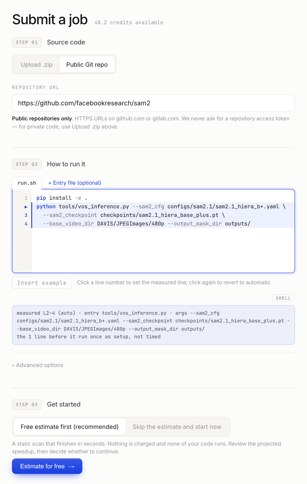
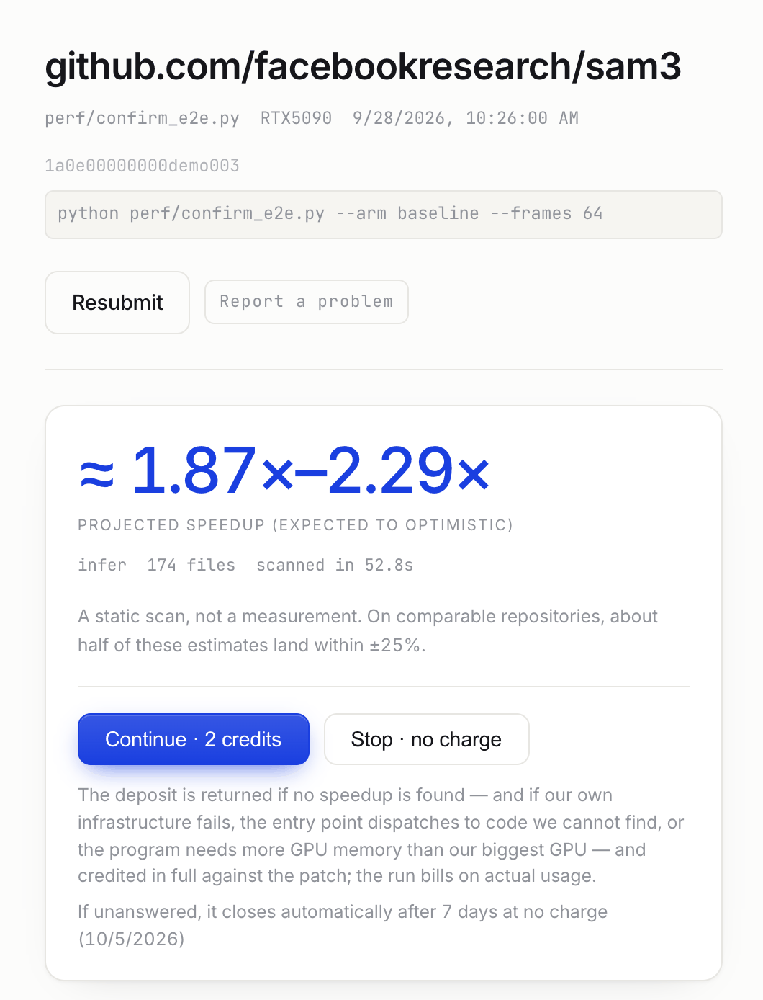
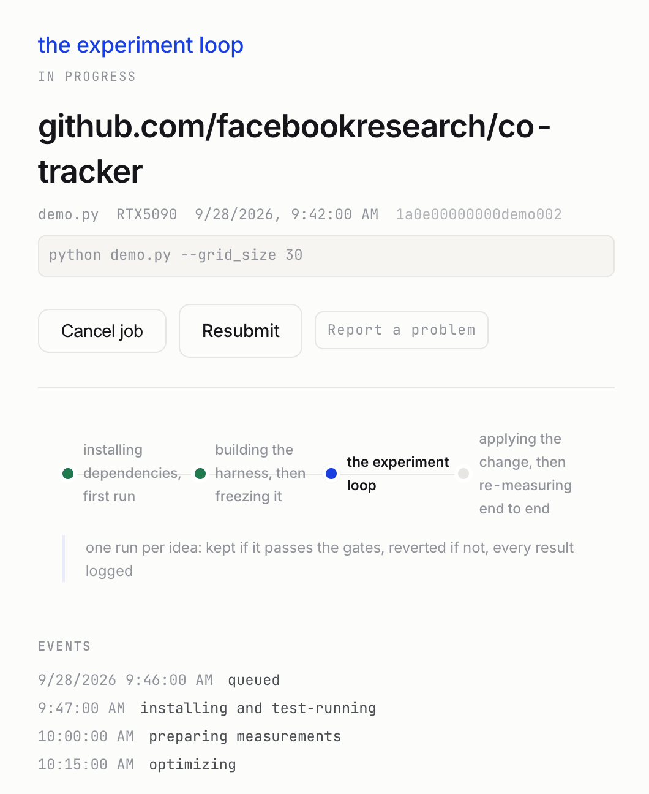
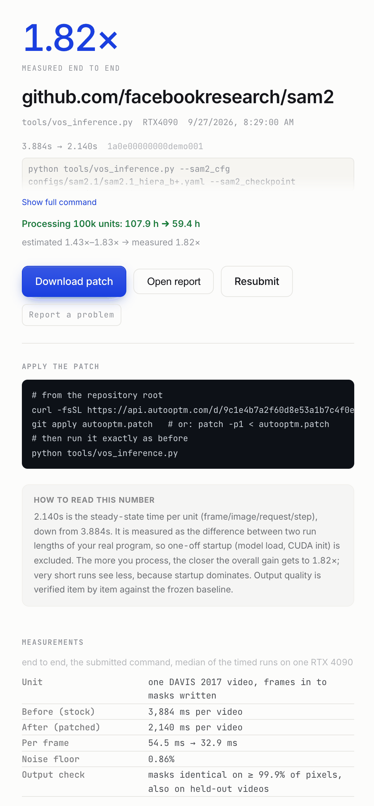
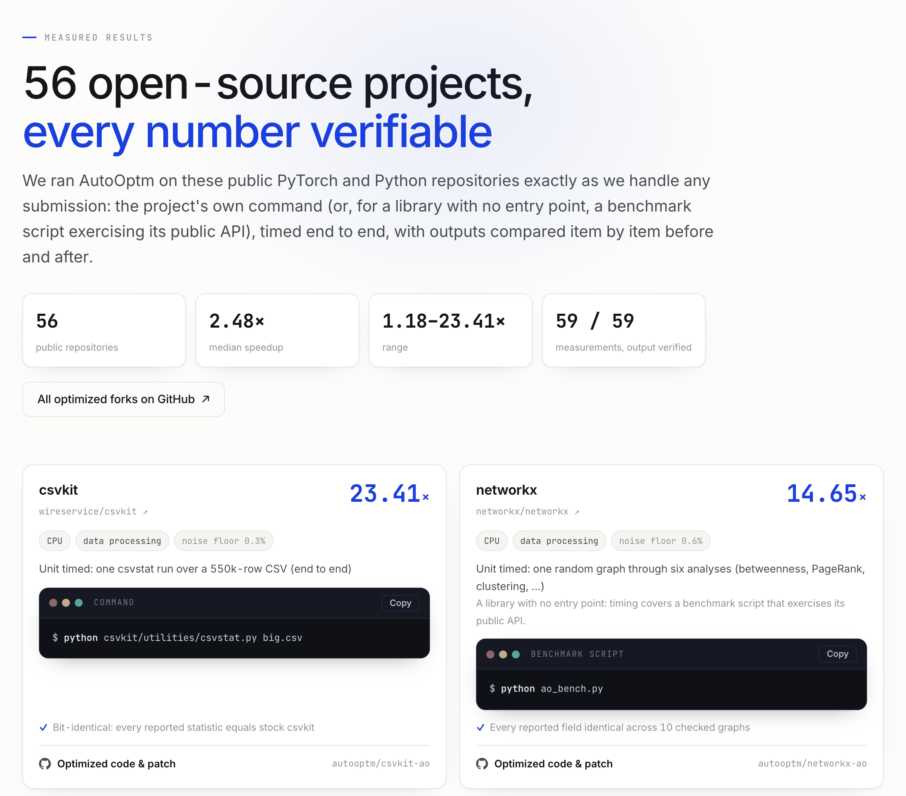

  
  <h2>AutoOptm — automated performance optimization for PyTorch and Python</h2>
  
Point it at a Git repository or upload a zip of your code. Get back a verified end-to-end speedup and the patch.

  
<a href="https://autooptm.com"><b>autooptm.com</b></a>

---

**How it works**

1. You give us your code — a Git repository or a zip — and the command you already run: training, inference or data processing.
2. We run it on a real GPU or CPU, measure the stock program, and optimize it.
3. The speedup is confirmed **end to end, in your own program**, and the output is checked against the stock one.
4. You get a patch you can `git apply`. No speedup, no charge.

**Product tour**

<table>
  <tr>
    <td width="50%" valign="top"> <b>1 · Submit.</b> A Git URL or a zip of your code, plus the command you already run.</td>
    <td width="50%" valign="top"> <b>2 · Free estimate.</b> A static scan in about a minute, no code executed. Continue or stop at no charge.</td>
  </tr>
  <tr>
    <td width="50%" valign="top"> <b>3 · Optimize.</b> Your program runs on a real GPU; every idea is measured and kept only if it passes.</td>
    <td width="50%" valign="top"> <b>4 · Result.</b> The speedup confirmed end to end in your own program, the output checked, and a patch to <code>git apply</code>.</td>
  </tr>
  <tr>
    <td colspan="2"> <b>Public results</b> at <a href="https://autooptm.com/results">autooptm.com/results</a>, each linked to its fork here.</td>
  </tr>
</table>

Screenshots use demo data (SAM 2's numbers are its real published result); no customer account is shown.

**Results so far** — 56 open-source projects, 59 measurements, median **2.48x** end to end.
Each fork is the upstream project plus one commit: the patch, and a README with the numbers and how to reproduce them.

| Project | What it does | Speedup | Measured on |
|---|---|---|---|
| [SwinIR](https://github.com/autooptm/SwinIR-ao) | image super-resolution | 13.15x | RTX 4090 |
| [CLIP](https://github.com/autooptm/CLIP-ao) | image–text embeddings | 8.56x | RTX 4090 |
| [DINOv2](https://github.com/autooptm/dinov2-ao) | self-supervised vision features | 5.22x | RTX 4090 D |
| [Sapiens](https://github.com/autooptm/sapiens-ao) | human pose estimation | 3.75x | A10 |
| [3D Gaussian Splatting](https://github.com/autooptm/gaussian-splatting-ao) | 3D scene reconstruction (training) | 3.42x | RTX 5090 |
| [Real-ESRGAN](https://github.com/autooptm/Real-ESRGAN-ao) | image and video upscaling | 3.35x | NVIDIA GPU |
| [DiT](https://github.com/autooptm/DiT-ao) | diffusion transformer (training) | 2.25x | H100 |
| [YOLOv12](https://github.com/autooptm/yolov12-ao) | object detection | 2.23x | RTX 4090 |
| [CoTracker](https://github.com/autooptm/co-tracker-ao) | point tracking in video | 1.90x | RTX 5090 |
| [Grounding DINO](https://github.com/autooptm/GroundingDINO-ao) | open-set object detection | 1.84x | RTX 4090 |
| [SAM 2](https://github.com/autooptm/sam2-ao) | video object segmentation | 1.82x | RTX 4090 |
| [SAM 3](https://github.com/autooptm/sam3-ao) | text-prompted segmentation | 1.63x | RTX 5090 |
| [VGGT](https://github.com/autooptm/vggt-ao) | 3D reconstruction from images | 1.58x | RTX 4090 |

**[See all results →](https://autooptm.com/results)**

---

Try it on your own code at <a href="https://autooptm.com">autooptm.com</a> · pip install autooptm
